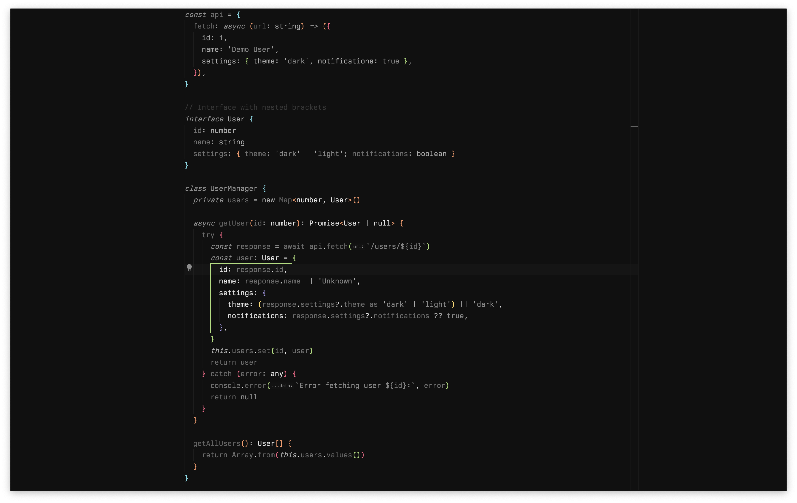
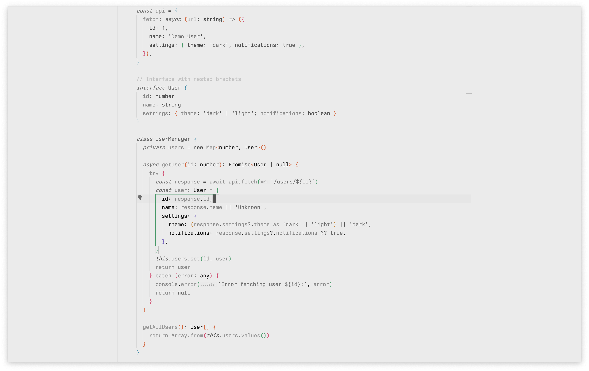

# Monochai

**Simple monochrome themes**

A clean monochrome theme inspired by [Monochrome](https://marketplace.visualstudio.com/items?itemName=anotherglitchinthematrix.monochrome) and [Monokai Pro](https://marketplace.visualstudio.com/items?itemName=monokai.theme-monokai-pro-vscode).

## What you get

- Dark and light versions
- Grayscale color scheme
- Monokai accent colors
- Clean, minimal interface

## Screenshots

### Monochai Dark



**Colors:** Background `#101010` | Text `#EBEBEB` | Accents `#77dce8` `#fd9867` `#ff6188` `#a9dc76` `#ac9df2` `#ffd866`

### Monochai Light



**Colors:** Background `#EBEBEB` | Text `#101010` | Accents `#198CA9` `#E25F32` `#E14775` `#279D69` `#7058BE` `#CD7A0A`

## Installation

1. Open Visual Studio Code
2. Go to Extensions (Ctrl+Shift+X / Cmd+Shift+X)
3. Search for "Monochai"
4. Click Install
5. Go to File > Preferences > Color Theme (or press Ctrl+K Ctrl+T / Cmd+K Cmd+T)
6. Select either "Monochai Dark" or "Monochai Light"

## Inspiration

Based on [Monochrome](https://marketplace.visualstudio.com/items?itemName=anotherglitchinthematrix.monochrome) and [Monokai Pro](https://marketplace.visualstudio.com/items?itemName=monokai.theme-monokai-pro-vscode) themes.

## Optional Settings

If you want to go full minimal, try these settings:

```json
{
  "breadcrumbs.enabled": false,
  "editor.guides.bracketPairs": "active",
  "editor.guides.bracketPairsHorizontal": "active",
  "editor.guides.highlightActiveBracketPair": false,
  "editor.guides.highlightActiveIndentation": true,
  "editor.minimap.enabled": false,
  "editor.renderLineHighlight": "all",
  "editor.renderWhitespace": "none",
  "editor.scrollbar.horizontal": "visible",
  "editor.scrollbar.vertical": "visible",
  "workbench.editor.showIcons": false,
  "workbench.tree.renderIndentGuides": "none"
}
```

## Issues

Bug reports and suggestions welcome on [GitHub](https://github.com/381181295/monochai).

## License

MIT - see [LICENSE](LICENSE) file.
